Group: Group 4

Group Members:

- Bombita, Virgil Ambrose
- Campos, Nicolas Scott
- Yang, Jerome

Project Title: Lab 1: UML Class Diagram to Java Program

Output Screenshots:
- Admin Module
  -
  - Admin Login
    
  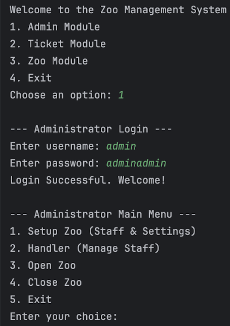
  - Zoo Setup
    
  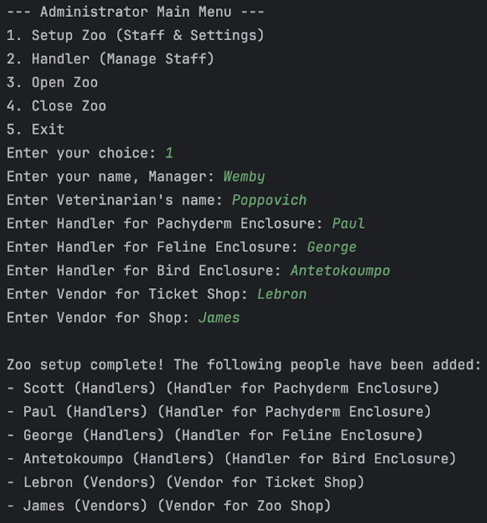
  - Handler
    
  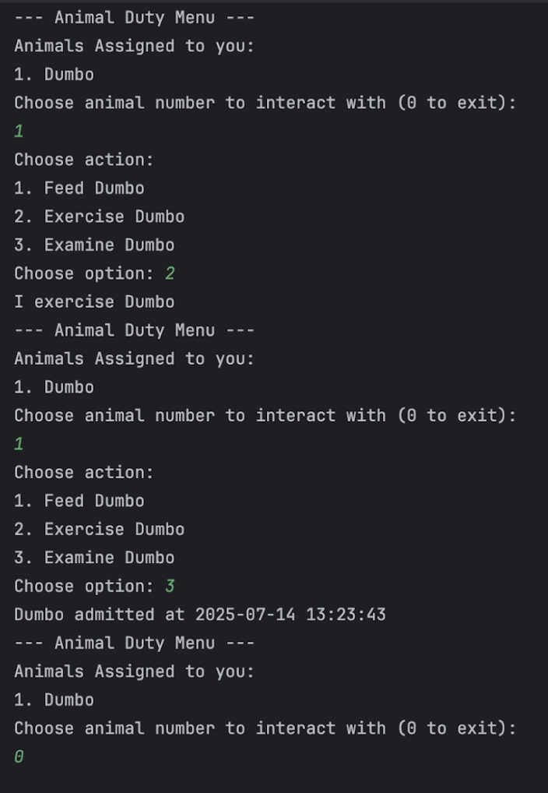
  - Open and Close Zoo
    
  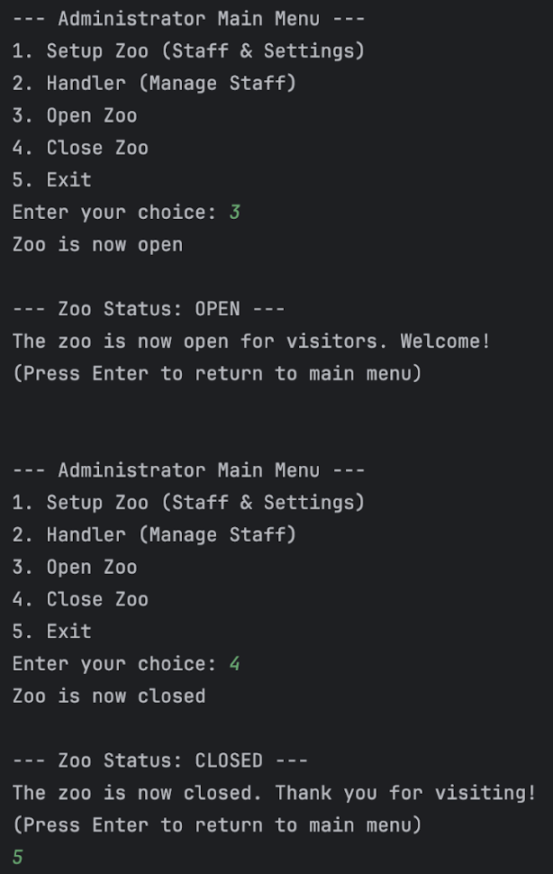

- Ticket Module

    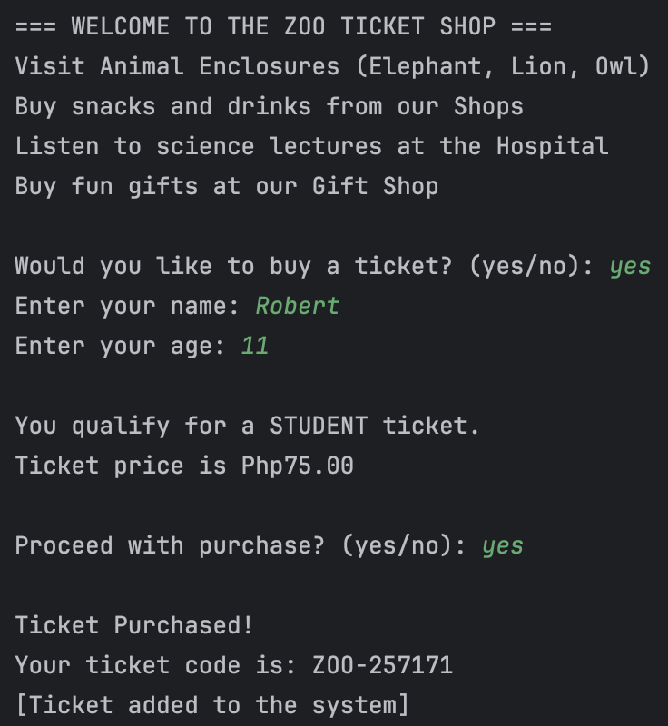

- Zoo Module
  - 
  - Closed Zoo
  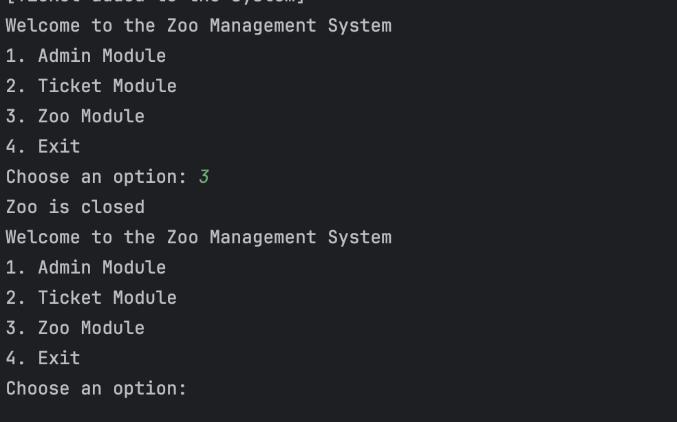

  - Enter Zoo
  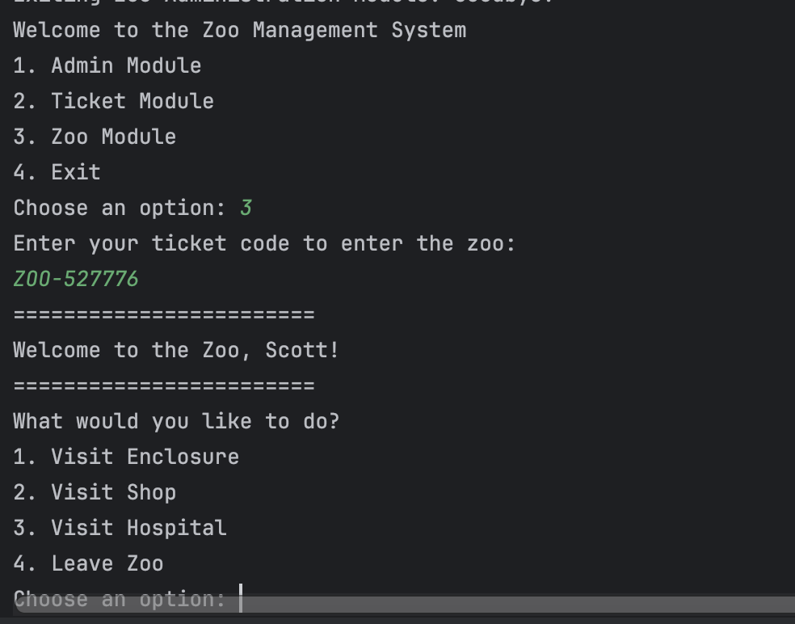
  
  - Visit Enclosure
  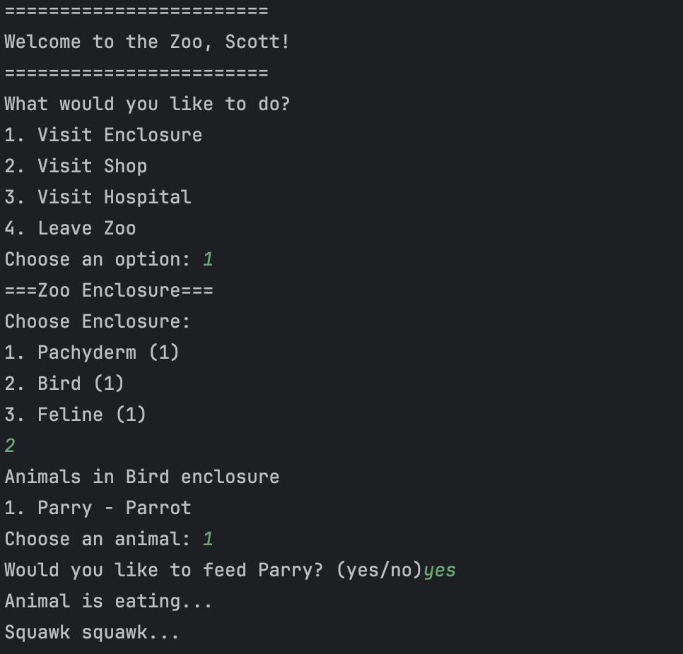
  
  - Visit Shop
  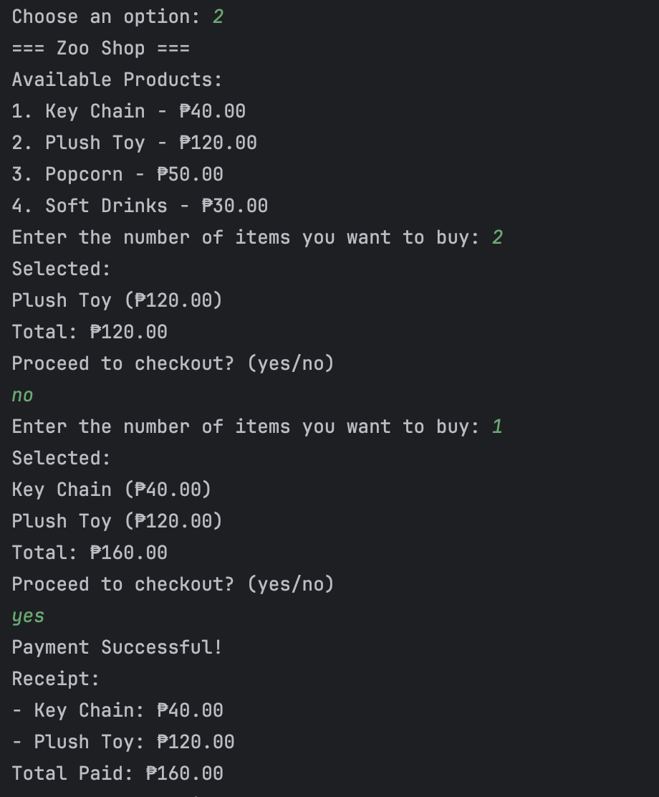

  - Visit Hospital
  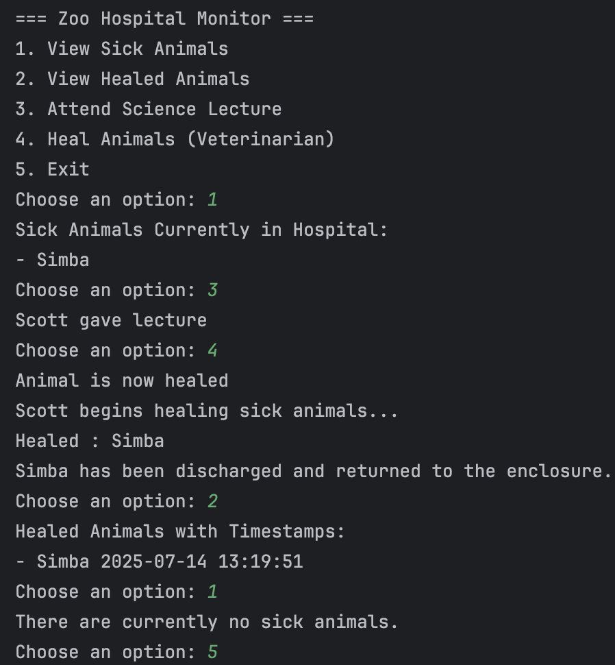

  - Leave Zoo
  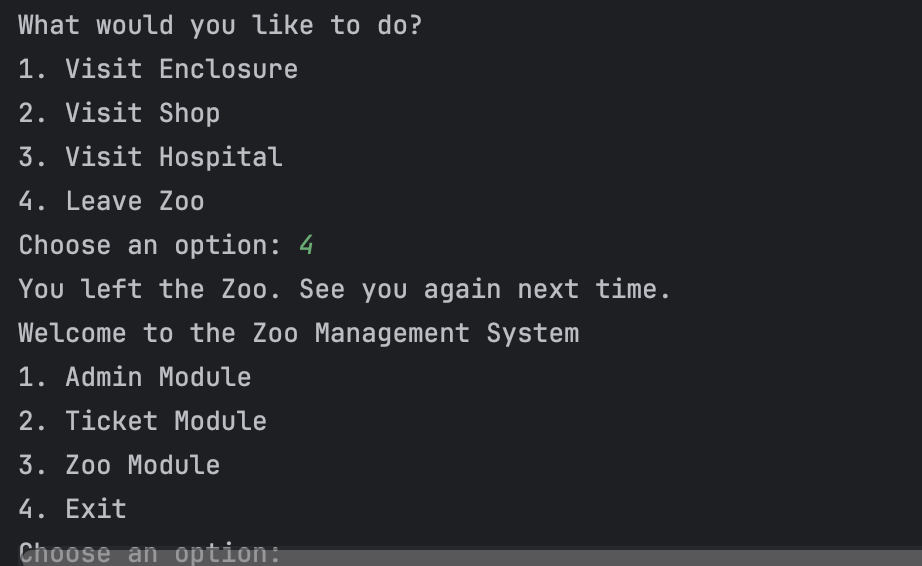

